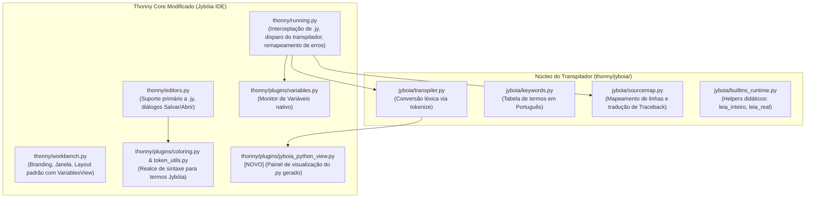

# Planejamento do Projeto: Jybóia IDE (Fork do Thonny IDE)

Este documento estabelece o plano detalhado de arquitetura e modificações para a criação do **Jybóia IDE** como um **Fork direto do Thonny IDE** (utilizando a base de código do Thonny em `reference-thonny-master`), incorporando o transpilador de Português Estruturado (`.jy` -> `.py`) de forma nativa e transparente.

---

## 1. Visão Geral e Estratégia do Fork

Em vez de reconstruir uma IDE do zero, o **Jybóia IDE** aproveita toda a robustez educacional do **Thonny IDE** (gerenciamento de janelas Tkinter, backend de execução CPython em subprocesso, debugger passo a passo, inspetor de memória e monitor de variáveis).

### Objetivos Principais:
1. **Transpilação Transparente**: Alunos escrevem em Português Estruturado (`.jy`), e a IDE gera e sincroniza a versão correspondente em Python (`.py`).
2. **Execução Nativa no Python do Sistema**: Ao pressionar **Executar (F5)** em um arquivo `.jy`, a IDE transpila o código, executa no interpretador Python e remapeia eventuais erros e tracebacks diretamente para a linha do `.jy`.
3. **Realce de Sintaxe Integrado**: Palavras-chave em português (`se`, `senao`, `enquanto`, `para`, `funcao`, `escreva`, `leia`, etc.) recebem coloração idêntica às palavras-chave nativas do Python.
4. **Monitor de Variáveis Ativo por Padrão**: O componente nativo de inspeção de variáveis do Thonny (`VariablesView`) é posicionado de forma visível para facilitar o aprendizado.
5. **Visualização Espelho (.jy <-> .py)**: Um painel/aba que exibe o código Python equivalente gerado em tempo real ou ao salvar.
6. **Identidade Visual Jybóia**: Branding, ícones, títulos e textos adaptados para o ambiente Jybóia.

---

## 2. Mapeamento de Arquivos do Thonny a serem Modificados / Criados

Com base na estrutura de código de `reference-thonny-master/thonny-master/thonny/`:



---

## 3. Detalhamento Técnico das Modificações no Thonny

### 3.1 Núcleo do Transpilador Integrado (`thonny/jyboia/`)
- Adição do pacote `thonny/jyboia/` contendo:
  - `transpiler.py`: Motor de substituição léxica baseado no `tokenize` do Python (preserva indentação, strings literais e comentários).
  - `keywords.py`: Dicionário completo de mapeamento de palavras-chave (`se` -> `if`, `senao` -> `else`, `senao se` -> `elif`, `enquanto` -> `while`, `para` -> `for`, `em` -> `in`, `intervalo` -> `range`, `funcao` -> `def`, `retorne` -> `return`, `escreva` -> `print`, `leia` -> `input`, `Verdadeiro` -> `True`, `Falso` -> `False`, `Nulo` -> `None`, `e` -> `and`, `ou` -> `or`, `nao` -> `not`, `eh` -> `is`, etc.).
  - `sourcemap.py`: Mapeamento de números de linha entre `.jy` e `.py` e tradutor amigável de tracebacks em português.
  - `builtins_runtime.py`: Funções utilitárias didáticas (`leia_inteiro`, `leia_real`, `leia_texto`).

### 3.2 Realce de Sintaxe (`thonny/token_utils.py` e `thonny/plugins/coloring.py`)
- Em `thonny/token_utils.py`:
  - Incorporar as palavras-chave do Jybóia à regex `KEYWORD` e `BUILTIN`.
  - Adicionar suporte a identificadores com acentuação em português (`função`, `senão`, `é`, `não`).
- Em `thonny/plugins/coloring.py`:
  - Garantir que tanto arquivos `.jy` quanto `.py` recebam coloração imediata de palavras-chave, variáveis, números e literais.

### 3.3 Gestão de Arquivos e Extensões (`thonny/editors.py`)
- Configurar a extensão padrão dos diálogos de criação e salvamento de arquivos para `.jy` (com `.py` como segunda opção).
- Ao salvar um arquivo `programa.jy`, salvar simultaneamente (ou gerar em background) o arquivo espelho `programa.py`.

### 3.4 Execução e Tratamento de Erros (`thonny/running.py`)
- No método `cmd_run_current_script`:
  - Se o arquivo atual for `.jy`:
    1. Transpilar o código para `.py`.
    2. Salvar o arquivo `.py` espelho no mesmo diretório do `.jy`.
    3. Enviar o arquivo `.py` para execução no backend CPython do Thonny.
- No receptor de mensagens e erros do backend:
  - Quando ocorrer uma exceção (`SyntaxError`, `ZeroDivisionError`, `NameError`, etc.), aplicar o `SourceMap` para converter a referência de linha do `.py` para a linha correspondente do `.jy`.
  - Exibir a linha em destaque no editor do `.jy` e injetar a dica didática em português no console.

### 3.5 Monitor de Variáveis (`thonny/plugins/variables.py`)
- Manter o `VariablesView` nativo do Thonny, configurando `workbench.py` para exibi-lo automaticamente no painel lateral direito por padrão, permitindo ao aluno ver o estado das variáveis a cada execução.

### 3.6 Painel de Visualização do Código Python Gerado (`thonny/plugins/jyboia_python_view.py`)
- Novo plugin/view acoplado que exibe em modo somente-leitura o código Python resultante da transpilação.
- Permite ao estudante comparar lado a lado o código em Português com o código em Python puro.

### 3.7 Identidade Visual e Configurações Padrão (`thonny/workbench.py`, `thonny/VERSION`)
- Nome da aplicação: **Jybóia IDE**.
- Versão: `2.0.0 (Base Thonny 5.0.0)`.
- Ícones da cobra Jybóia / identidade visual personalizada.

---

## 4. Fases de Implementação

### Fase 1: Transposição do Fork e Estruturação do Código
- Configurar o diretório de trabalho do Jybóia baseado no código-fonte de `reference-thonny-master/thonny-master/thonny`.
- Adicionar o submódulo `thonny/jyboia/` com o transpilador e suíte de testes unitários.

### Fase 2: Integração do Realce de Sintaxe e Extensão .jy
- Modificar `token_utils.py` e `plugins/coloring.py` para realçar a gramática em Português Estruturado.
- Modificar `editors.py` para associar arquivos `.jy` ao editor principal.

### Fase 3: Integração do Runner de Execução e Remapeamento de Erros
- Modificar `running.py` para interceptar a execução de arquivos `.jy`, disparar a transpilação e gravar o `.py`.
- Integrar o resolvedor de tracebacks para apontar as linhas no `.jy`.

### Fase 4: Visualização Espelho (.py) e Configuração do Monitor de Variáveis
- Implementar a view `jyboia_python_view.py` no workbench.
- Ajustar `workbench.py` para abrir com o editor `.jy`, o visualizador `.py`, o Shell e o Monitor de Variáveis visíveis por padrão.

### Fase 5: Validação, Exemplos e Testes Finais
- Validar a execução de algoritmos didáticos completos (estruturas condicionais, laços, funções, E/S).
- Testar o monitoramento de variáveis em tempo real.
- Testar o comportamento em erros propositais (sintaxe e runtime).

### Fase 6: Empacotamento Portable Onedirectory e Resolução de Edge Cases
- Normalização de caminhos locais no Windows (`thonny/misc_utils.py`) para compatibilidade perfeita com os diálogos nativos do Tkinter (`askopenfilename()`), resolvendo a abertura de arquivos da pasta `samples/`.
- Proteção na execução de scripts não salvos em `thonny/running.py`: bloqueio por padrão com chamada ao diálogo "Salvar Como", fallback para auto-salvamento em `unsaved.jy` e garantia de transpilação para códigos sem nome em memória.
- Empacotamento Portable oficial no formato **Onedirectory** via PyInstaller (`jyboia.spec`), isolamento com `portable_thonny.ini`, inclusão direta de `samples/`, interpretadores embutidos `python.exe`/`pythonw.exe`, biblioteca padrão `Lib/` e módulos Jybóia para ativação instantânea do backend e do botão Executar (F5).

---

## 5. Plano de Verificação

### Testes Automatizados
- Execução de testes unitários do transpilador Jybóia integrado ao pacote:
  ```bash
  python -m unittest discover -s thonny/jyboia/tests
  ```
- Testes de tokenização e realce léxico.

### Verificação Manual
1. Iniciar o Jybóia IDE:
   ```bash
   python -m thonny
   ```
2. Criar um novo arquivo `tabuada.jy`.
3. Escrever o código com `para`, `em`, `intervalo`, `escreva`.
4. Verificar se as palavras-chave estão coloridas corretamente.
5. Observar o painel "Código Python Gerado" refletindo a tradução para `for`, `in`, `range`, `print`.
6. Pressionar **F5**:
   - Verificar a saída no Shell.
   - Verificar o arquivo `tabuada.py` gerado na pasta.
   - Verificar as variáveis `i`, `resultado`, etc. preenchidas no Monitor de Variáveis.
7. Inserir um erro proposital (ex: `10 / 0`) e conferir se o erro reporta a linha do arquivo `tabuada.jy` com dica explicativa.
